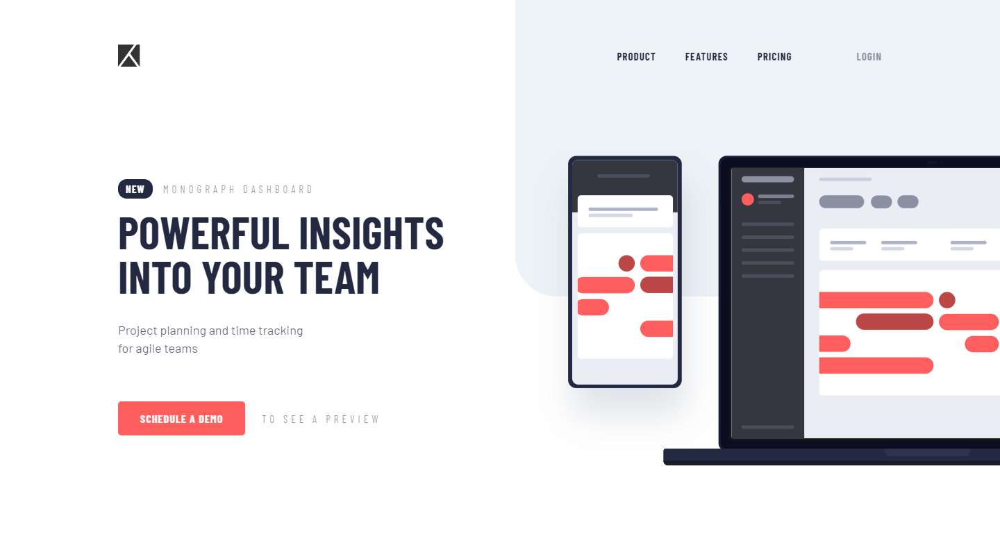
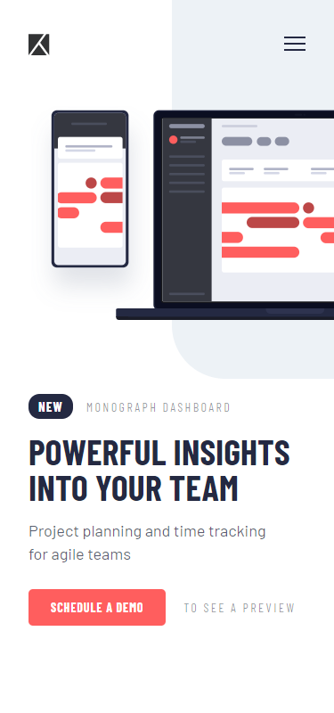
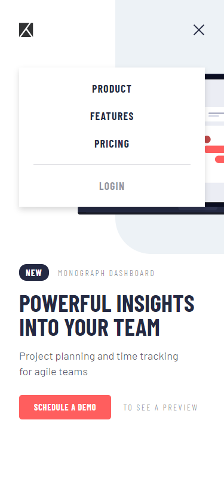

# Frontend Mentor - Project tracking intro component solution

This is a solution to the [Project tracking intro component challenge on Frontend Mentor](https://www.frontendmentor.io/challenges/project-tracking-intro-component-5d289097500fcb331a67d80e). Frontend Mentor challenges help you improve your coding skills by building realistic projects.

## Table of contents

- [Overview](#overview)
  - [The challenge](#the-challenge)
  - [Screenshot](#screenshot)
  - [Links](#links)
- [My process](#my-process)
  - [Built with](#built-with)
  - [What I learned](#what-i-learned)
- [Author](#author)

## Overview

### The challenge

Users should be able to:

- View the optimal layout for the site depending on their device's screen size
- See hover states for all interactive elements on the page

Notes:

- Create the background shape using code

### Screenshot

### Links

- Solution URL: (https://www.frontendmentor.io/solutions/responsive-project-tracking-page-with-mobile-navigation-X7y7chuST)
- Live Site URL: (https://lm-project-tracking-intro.netlify.app/)

## My process

### Built with

- Semantic HTML5 markup
- CSS custom properties/vars
- Desktop-first workflow
- Vanilla javascript

### What I learned

I practiced my positioning a lot, with the image especially.

Another thing I had to take careful care of is z index of multiple elemtents so things stacked correctly, whilst keeping the code maintainable and not using over the top z index's like 9999 etc. I had to ensure the background rectangle stayed underneath everything, while the mobile navigation was over the top of everything, which I had to focus to do as there positions in the HTML were different (position in html creates different stacking contexts).

## Author

- Website - [Leon Michalak](https://www.leonmichalak.tech)
- Frontend Mentor - [@NinjaInShade](https://www.frontendmentor.io/profile/NinjaInShade)
- Instagram - [@lmdeveloper](https://www.instagram.com/lmdeveloper/)
